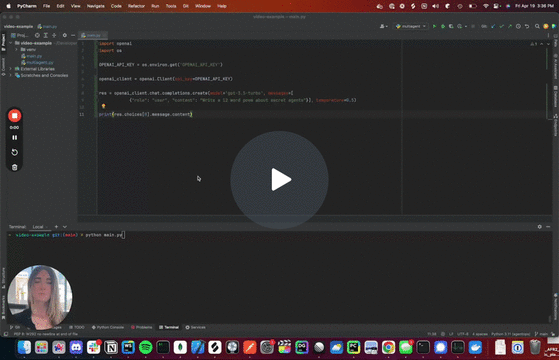

#  Boilerplate CrewAI + AgentRun

##   Learn the basics
Using [DeepLearning.ai course "Multi AI Agent Systems with CrewAI](https://www.deeplearning.ai/short-courses/multi-ai-agent-systems-with-crewai/)

<center>


</center>

##  Design
Leverage [CrewAI Chat with Docs](https://chat.openai.com/g/g-qqTuUWsBY-crewai-assistant)  

##  Inference  
Set OpenAI or (Groq)[https://console.groq.com/keys] API keys in `.env`  
Or locally using your favorite LLM runtime


##  Installation
Ensure you have Python >=3.10 <=3.13 installed on your system.  
This project uses [Poetry](https://python-poetry.org/) for dependency management and package handling, offering a seamless setup and execution experience.  

```bash
pip install poetry
```

Next, navigate to your project directory and install the dependencies:

1. First lock the dependencies and then install them:
```bash
poetry lock
```
```bash
poetry install
```

### Customizing

**Add your `OPENAI_API_KEY` into the `.env` file**

- Modify `src/config/agents.yaml` to define your agents
- Modify `src/config/tasks.yaml` to define your tasks
- Modify `src/crew.py` to add your own logic, tools and specific args
- Modify `src/main.py` to add custom inputs for your agents and tasks

##  Edits using `aider`
You can easily generate diffs using [Aider Chat](https://aider.chat/)


## Running the Project

To kickstart your crew of AI agents and begin task execution, run this from the root folder of your project:

```bash
python src/main.py
```

This command initializes the Crew, assembling the agents and assigning them tasks as defined in your configuration.

This example, unmodified, will run the create a `report.md` file with the output of a research on LLMs in the root folder.

## Understanding Your Crew

The Crew is composed of multiple AI agents, each with unique roles, goals, and tools.  
These agents collaborate on a series of tasks, defined in `config/tasks.yaml`, leveraging their collective skills to achieve complex objectives. The `config/agents.yaml` file outlines the capabilities and configurations of each agent in your crew.

##  Chat UI
Run it using
```bash
streamlit run src/ui/chat.py
```  
{:height="50%" width="50%"}

##  Code executor
Running code using `agentrun` see [here](https://pypi.org/project/agentrun/)

##  Observability
Using [AgentOps](https://www.loom.com/share/cfcaaef8d4a14cc7a974843bda1076bf) to track calls

[](https://www.loom.com/share/cfcaaef8d4a14cc7a974843bda1076bf)

##  Devcontainers
Config in `.devcontainer`

##  Pre-commit
Setup `pre-commit` hooks using `pre-commit install`  

## Run tests
Tests are in `tests`  
Run `pytest`

##  Github Actions
GitHub actions running `pre-commit` hooks and `pytest` are setup in `.github/workflows`  
You can run them locally using `act` see [here](https://github.com/nektos/act)


##  Troubleshooting
`chroma-hnsw` on Mac requires `export HNSWLIB_NO_NATIVE=1` to [build](https://docs.trychroma.com/troubleshooting).  